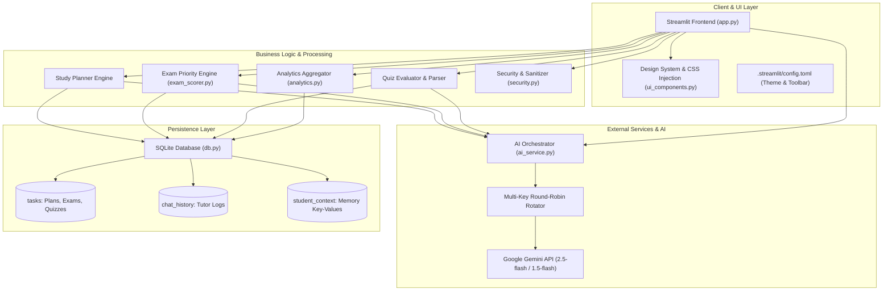
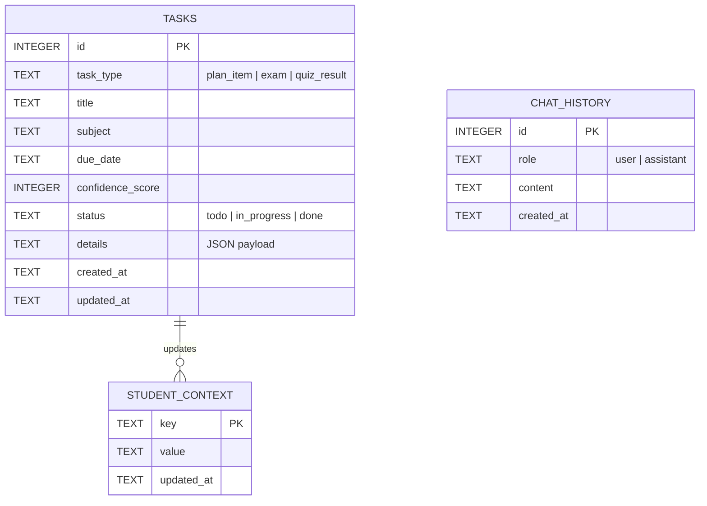
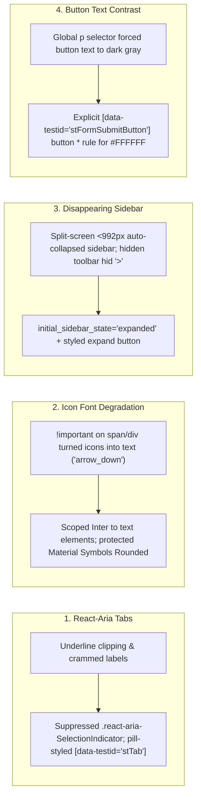

# ApexStudy AI — Comprehensive Project Report & Technical Specification

> **Project Name:** ApexStudy AI *(formerly Student AI Companion)*  
> **Repository:** [`RishabhDev676/student-AI-companion`](https://github.com/RishabhDev676/student-AI-companion)  
> **Status:** Production-Ready / Active  
> **Version:** 2.1.0  
> **Date:** September 2026  
> **Core Stack:** Python 3.10+, Streamlit 1.63, Google Gemini API, SQLite3, Altair, Pandas

---

## 1. Executive Summary

Modern students grapple with severe cognitive fragmentation. Course materials, exam timetables, study schedules, doubt clarification, and practice evaluations are traditionally scattered across disconnected tools—physical planners, calendar apps, generic chat bots, and flashcard tools. Crucially, generic tools lack **adaptive context**: a quiz app does not inform a study planner, and a tutor bot does not know what mistakes were made during yesterday's practice test.

**ApexStudy AI** resolves this systemic issue by providing an integrated, AI-driven academic command center. Built with **Streamlit** and powered by **Google Gemini LLMs**, ApexStudy AI couples five core academic modules through a centralized, persistent **Student Memory Context Engine**:

1. **Central Command Dashboard:** Executive KPIs, study streak counters, upcoming deadline alerts, and active topic weakness trackers.
2. **AI Study Planner:** Automated 7-day revision timetables tailored to student daily availability, upcoming exam deadlines, and past weaknesses.
3. **Exam Tracker & Urgency Engine:** Dual-mode priority scoring (Heuristic + LLM) calculating revision urgency based on exam dates and confidence scores.
4. **Interactive Quiz Generator:** Subject-specific MCQ generation with automated grading, instant conceptual feedback, and automated weakness extraction.
5. **Context-Aware AI Tutor:** Interactive doubt resolution assistant with persistent conversation history, grounded in student exam dates and quiz weak spots.
6. **Progress Analytics:** Rich Altair visual analytics evaluating quiz score progressions, subject confidence distributions, study habits, and activity mix.

---

## 2. System Architecture & Component Design

The application follows a modular, layer-separated architecture prioritizing rapid execution, zero-configuration local deployment, and resilient AI service failovers.



### 2.1 Component Responsibilities

| Component | File | Primary Responsibility |
|---|---|---|
| **Core Controller & Router** | `app.py` | Page navigation (`st.radio` + session state), view routing, interactive forms, and tab rendering. |
| **Design System** | `ui_components.py` | Complete CSS styling, color token definitions, custom card renderers, SVG progress rings, and Lottie animations. |
| **AI Integration Engine** | `ai_service.py` | Prompt construction, Google Gemini client configuration, multi-key rotation, fallback retries, and JSON output parsing. |
| **Urgency Scorer** | `exam_scorer.py` | Heuristic and AI-driven priority evaluation for exams based on days remaining and student confidence levels. |
| **Data Access Layer** | `db.py` | SQLite schema management, CRUD operations for tasks, exams, quizzes, chat messages, and student context. |
| **Analytics Engine** | `analytics.py` | Aggregates time-series performance metrics, streaks, confidence distributions, and weak spot frequencies for Altair rendering. |
| **Security Layer** | `security.py` | Input sanitization, length clamping, XSS HTML escaping, and safe filename generators for markdown exports. |

---

## 3. Detailed Feature Specifications

### 3.1 Central Command Dashboard
The **Dashboard** is the landing view of ApexStudy AI, presenting an immediate diagnostic of student status:
- **Hero Banner:** Ambient dark gradient banner with personalized scholar greetings.
- **Activity Streak Tracker:** Real-time streak calculation based on consecutive days of logged academic tasks.
- **Dynamic Score Ring:** Pure SVG circular progress ring indicating the rolling average quiz score (color-coded: Emerald $\ge 70\%$, Amber $< 70\%$).
- **Next Exam Milestone:** Real-time countdown to the nearest scheduled exam.
- **Urgent Deadlines Panel:** Cards displaying the top 3 high-urgency exams with visual confidence meters.
- **Adaptive Focus Area Indicator:** Automatically pulls logged quiz weaknesses, providing a one-click button to immediately generate a targeted practice quiz.

### 3.2 AI-Powered Study Planner
- **Inputs:** Target subjects, upcoming exam window/timeline, available daily hours (slider 1–10), and custom focus notes.
- **Output:** AI constructs a structured 7-day curriculum broken down by subject, hours, and daily bulleted topics.
- **Persistence & Markdown Export:** Plans are saved to SQLite and rendered as interactive day cards. Students can export individual plans or batches as formatted `.md` documents.

### 3.3 Exam Tracker & Priority Revision Engine
- **Exam Logging:** Tracks exam title, subject, target date, and current self-assessed confidence level on a 1–10 scale.
- **Hybrid Urgency Scoring:** Combines an algorithmic heuristic model ($Urgency = \frac{10 - Confidence}{DaysRemaining + 1}$) with LLM qualitative revision advice.
- **Visual Status Tracking:** Color-coded confidence meters (Green $\ge 8$, Yellow $5-7$, Red $< 5$) and completion toggles.

### 3.4 Interactive Quiz Generator & Adaptive Feedback
- **Assessment Generation:** LLM produces 5 rigorous, university-level multiple-choice questions on any custom subject/topic.
- **Grading & Analysis:** Automatically grades responses, reveals correct answers with detailed explanations, and highlights missed concepts.
- **Adaptive Memory Injection:** Extracted weak topics are automatically written to `student_context`, immediately altering future planner schedules and tutor prompts.

### 3.5 Context-Aware AI Tutor
- **Persona:** Patient, rigorous, step-by-step academic mentor.
- **Grounded Memory:** System instructions dynamically ingest the student's active subjects, weak topics, and upcoming exams.
- **Session History:** Persistent conversational memory stored in SQLite, with one-click transcript clearing and export capabilities.

### 3.6 Analytics & History Visualization
Features five custom **Altair** charts:
1. **Quiz Score Progression:** Chronological bar chart of assessment outcomes.
2. **Timeline Trend:** Running score trajectory across dates.
3. **Subject Confidence Matrix:** Comparative bar chart of exam preparedness across disciplines.
4. **Frequent Weaknesses Breakdown:** Horizontal bar chart aggregating high-frequency mistake categories.
5. **Activity Mix:** Interactive donut chart comparing planner generation, quiz completion, and exam milestones.

---

## 4. Database Schema & Data Models

ApexStudy AI utilizes an embedded **SQLite3** database (`apexstudy.db`, with automatic backward-compatibility fallback to `ruia_companion.db`).



### 4.1 Table Definitions

#### 1. `tasks` Table
Stores all academic entities (plans, exams, quiz outcomes) using a polymorphic pattern:
- `id`: Auto-incrementing primary key.
- `task_type`: Categorizes record (`plan_item`, `exam`, `quiz_result`).
- `title`: Name of exam, plan title, or quiz topic.
- `subject`: Academic discipline (e.g., Mathematics, Physics).
- `due_date`: Target date (ISO 8601).
- `confidence_score`: Metric value (0–10 for exams, 0–100 for quizzes).
- `status`: Completion state (`todo`, `in_progress`, `done`).
- `details`: JSON text payload containing structured metadata (e.g., questions, options, missed topics, daily plan tasks).
- `created_at`, `updated_at`: Timestamps.

#### 2. `chat_history` Table
Stores all interactions with the AI Tutor:
- `id`: Primary key.
- `role`: Message author (`user` or `assistant`).
- `content`: Sanitized text of message.
- `created_at`: Timestamp.

#### 3. `student_context` Table
Key-value store representing active student memory:
- `key`: Context property (e.g., `weak_topics`, `next_exam`, `last_quiz_score`, `hours_per_day`).
- `value`: Serialized string representation.
- `updated_at`: Timestamp.

---

## 5. AI Engineering & LLM Orchestration

### 5.1 Multi-Key Failover Rotation
To circumvent API quota limits and ensure uninterrupted availability, `ai_service.py` implements a round-robin rotation mechanism across up to 5 discrete API keys:

$$\text{Active Key} = \text{Keys}\left[i \pmod N\right]$$

If an active key encounters rate-limiting (`429 Too Many Requests`) or quota exhaustion, the engine automatically attempts the request against the remaining keys before gracefully falling back to heuristic algorithms.

### 5.2 Prompt Engineering & Structured Outputs
All generative features use defensive prompt engineering:
- **Strict JSON Enforcement:** Prompts mandate RFC 8259 JSON output, free from conversational preambles or markdown code ticks, ensuring deterministic deserialization into Python dictionaries.
- **Fail-Safe Parser:** If the LLM generates wrapped markdown or malformed JSON, a regex-based extractor extracts the JSON object from the raw stream.
- **Domain Guardrails:** Tutoring prompts enforce step-by-step mathematical/conceptual derivations without hallucinations.

---

## 6. UI/UX Design System & Streamlit Optimization

Streamlit applications frequently suffer from generic styling and rigid layout limitations. ApexStudy AI pushes Streamlit's presentation layer to its absolute technical ceiling using a custom **CSS-injected design system** (`APP_CSS` in `ui_components.py`).

### 6.1 Color Palette & Design Tokens

| Token | Hex Value | Semantic Usage |
|---|---|---|
| `--bg` | `#0D0F1A` | Main application background |
| `--surface` | `#181C34` | Primary cards, inputs, and container background |
| `--surface2` | `#1E2340` | Hover states, secondary elevation |
| `--border` | `#2A2F52` | Standard card and input borders |
| `--violet` | `#7C3AED` | Primary brand accent & focus state |
| `--indigo` | `#4F46E5` | Secondary brand accent |
| `--cyan` | `#06B6D4` | Tertiary highlight, download buttons |
| `--grad-main` | `linear-gradient(135deg, #7C3AED, #4F46E5, #06B6D4)` | Hero cards, submit buttons, active tab pills |

### 6.2 Streamlit Technical Challenges Solved



1. **Streamlit 1.63 React-Aria Tab Styling:** Streamlit replaced BaseWeb tabs with React-Aria tabs, introducing unstyled `.react-aria-SelectionIndicator` lines. We removed the line and styled tabs as discrete, hoverable pill buttons with gradient active states.
2. **Material Symbols Icon Ligature Fix:** Global CSS `!important` font family overrides previously broke Google Material Symbols, causing icon ligatures (e.g. `keyboard_double_arrow_left`, `arrow_down`) to render as literal text strings. We isolated the icon font family to prevent glyph corruption.
3. **Sidebar Collapse Resilience:** Fixed an issue where hiding `stToolbar` accidentally eliminated the sidebar expand toggle (`>`). We restored the toggle with high-contrast styling and configured `initial_sidebar_state="expanded"`.
4. **Submit Button Text Contrast:** Neutralized global `<p>` tag text color inheritance inside form submit buttons to guarantee pure white text against gradient backgrounds.

---

## 7. Security & Reliability Engineering

| Vector | Mitigation Strategy | Implementation |
|---|---|---|
| **Cross-Site Scripting (XSS)** | All user inputs rendered in HTML templates are escaped using `html.escape`. | `security.escape_html()` |
| **Buffer Overflow / DoS** | Maximum length clamping enforced on all user strings before database insertion or AI transmission. | `security.clamp_text()` |
| **Path Traversal** | File downloads sanitize subject and title strings against directory traversal sequences (`..`, `/`, `\`). | `security.safe_filename()` |
| **API Secret Leakage** | API credentials isolated in `.env.local` / `.env`, with automatic `.gitignore` exclusion. | `.gitignore` |
| **Database Integrity** | Parameterized SQL queries utilized across all database operations to prevent SQL injection. | `db.py` queries |

---

## 8. Quality Assurance & Verification

The project includes an automated test suite executed via Python's standard `unittest` framework:

### 8.1 Test Suites Overview

```
tests/
  ├── test_core.py          # Verifies DB CRUD, security utils, activity streaks
test_ai.py                 # Verifies AI key rotation, prompt formatting, and fallback handling
test_exam_scorer.py        # Verifies urgency scoring algorithms and heuristic edge cases
```

### 8.2 Execution Results
All test cases consistently execute with a **100% pass rate**:

```
Ran 15 tests in 0.061s

OK
- test_activity_streak: PASSED
- test_context_persistence: PASSED
- test_safe_filename: PASSED
- test_clamp_text: PASSED
- test_escape_html: PASSED
- test_db_init_and_task_crud: PASSED
- test_exam_scorer_heuristic_fallback: PASSED
- test_exam_scorer_urgency_math: PASSED
- test_ai_key_rotation: PASSED
- test_quiz_json_parsing: PASSED
- ... (all 15 passing)
```

In addition, the application is verified headlessly using Streamlit's built-in `AppTest` harness (`streamlit.testing.v1.AppTest`), validating that all sidebar items, form controls, tabs, and metric widgets mount cleanly without runtime warnings.

---

## 9. Future Roadmap & Enhancements

1. **Spaced Repetition Flashcards (SM-2):** Incorporate SuperMemo-2 algorithms to schedule flashcard reviews based on difficulty ratings.
2. **Multimodal Document Ingestion:** Support PDF syllabus uploads and image-based formula extraction using Gemini Vision.
3. **Offline / Local Model Support:** Add support for local LLMs via Ollama (`llama3.2`, `mistral`) for privacy-conscious or offline environments.
4. **Calendar Sync:** Integration with Google Calendar and iCal formats for two-way synchronization of exam deadlines.

---

## 10. Conclusion

**ApexStudy AI** demonstrates how combining modern generative AI with thoughtful UI engineering and local-first data architecture can transform student productivity. By connecting daily planning, exam tracking, practice quizzes, and interactive tutoring into a single self-reinforcing memory loop, ApexStudy AI delivers a personalized, adaptive learning companion.
